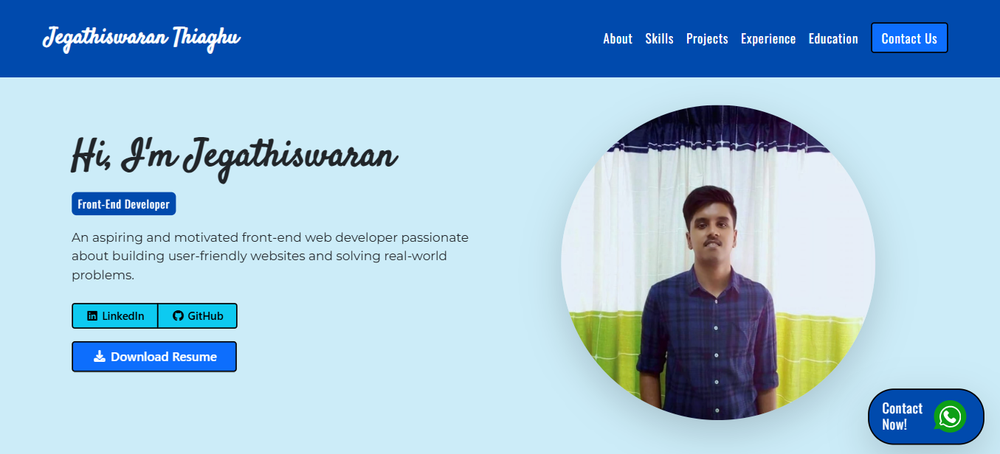

# My Enhanced Personal Portfolio Website 💼

This is the second and enhanced version of my personal portfolio website, built with modern web technologies. It showcases my projects and skills while making extensive use of **Bootstrap components** such as **cards, buttons, tabs, alerts, and forms** to create a responsive, interactive, and visually appealing design.

🌐 **Live Website:** [View My Portfolio](https://jega1312.github.io/portfolio-v2/)

## 📸 Preview

## ✨ Features
- 📱 Responsive design  
- 🖥️ Interactive portfolio section
- 💫 Smooth animations and icons  
- 🖼️ Carousel for showcasing projects
- 📝 Contact form integrated with Google Sheets  
- 💬 Floating WhatsApp button for quick contact  
- 📧 Email link in the footer for easy communication

## 🛠️ Technologies Used
- 🌐 HTML5, CSS3, JavaScript  
- 🅱 Bootstrap 5  
- 🎬 Animate.css  
- ⭐ Font Awesome 7
- 🎠 Owl Carousel  
- 📊 Google Apps Script (Google Sheet Integration)  
- 🚀 GitHub Pages (Web Hosting)  

## 📄 License
MIT License

---

© 2026 Jegathiswaran Thiagu
